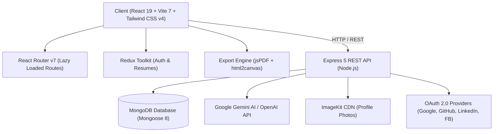

<div align="center">

# 🐸 Froggie — AI Resume Builder & ATS Score Checker

<p align="center">
  <strong>Craft 100% ATS-Compliant Resumes, Optimize for Hiring Algorithms, and Accelerate Your Career with AI.</strong>
</p>

[](https://froggie.site/)
[](https://github.com/Sujeetshar14921/froggie-ai-resume)
[](LICENSE)

<br />

[](https://react.dev/)
[](https://vitejs.dev/)
[](https://tailwindcss.com/)
[](https://redux-toolkit.js.org/)
[](https://nodejs.org/)
[](https://expressjs.com/)
[](https://www.mongodb.com/)
[](https://ai.google.dev/)

</div>

---

## 📌 Overview

**Froggie** is a next-generation, full-stack AI-powered career platform that empowers job seekers to build, audit, and export job-winning resumes tailored to bypass Applicant Tracking Systems (ATS). 

Unlike conventional resume makers that lock features behind expensive paywalls, Froggie is built to be fast, free, and recruiter-focused. It pairs an intuitive real-time dual-pane editor with state-of-the-art **Google Gemini AI**, offering intelligent content rewriting, an automated PDF resume importer, a 7-factor ATS compatibility scanner, and a persistent **AI Career Copilot** for interview prep and personalized cover letters.

---

## ✨ Key Features

### 📄 1. Interactive Real-Time Resume Builder
- **Instant Dual-Pane Live Preview**: Update any field and witness real-time layout updates instantly.
- **Comprehensive Section Management**:
  - Personal Details & Profile Photo (ImageKit CDN integration)
  - Impact-Driven Professional Summary
  - Chronological Work Experience & Responsibilities
  - Technical & Soft Skills Categorization
  - Projects with Live Demos & Repository Links
  - Education, Degrees, GPA & Institutions
  - Certifications & Honors / Achievements
- **Dynamic Color Palettes**: Pick from curated accent colors (Emerald, Indigo, Royal Blue, Teal, Purple, etc.) with instant theme application.
- **Multi-Resume Management**: Create, duplicate, rename, and manage multiple resume variants from the personal dashboard.

---

### 🤖 2. AI Content Enhancement Engine
Powered by **Google Gemini** through an OpenAI-compatible interface:
- **AI Summary Generator**: Transforms rough career notes into crisp, high-impact 2–3 sentence executive statements emphasizing quantifiable results.
- **AI Bullet Point Polish**: Enhances job experience descriptions using strong action verbs, quantifiable metrics (Google's XYZ formula), and ATS-friendly keywords.
- **Smart PDF Resume Importer**: Upload an existing PDF resume; Froggie's intelligent parser automatically extracts the text, maps it against a structured JSON schema, and populates the builder in seconds.

---

### 🎯 3. Advanced ATS Score Checker & Keyword Scanner
Ensures your resume lands on human recruiters' desks, not rejected by ATS filters:
- **Multi-Dimensional Weighted Scoring Model**:
  | Evaluation Dimension | Weight | Description |
  | :--- | :---: | :--- |
  | **Keyword Match** | **30%** | Density and alignment with the target Job Description (JD) |
  | **Skills Match** | **25%** | Overlap between required technical/soft skills and candidate profile |
  | **Experience Alignment** | **15%** | Relevance of past roles, seniority, and responsibilities |
  | **Job Title Match** | **10%** | Consistency between current title and prospective position |
  | **Education Match** | **10%** | Required degrees, fields of study, and qualifications |
  | **Formatting & Structure**| **5%** | Clean hierarchy, lack of parsing obstacles or unreadable elements |
  | **Readability & Grammar** | **5%** | Flow, sentence density, and grammatical accuracy |
- **Interactive Visual Score Gauge**: Displays an aggregate score (0–100) alongside qualitative ratings (*Excellent Match*, *Strong Match*, *Fair Match*, *Needs Improvement*, *Poor Match*).
- **Skill Gap & Missing Keyword Analysis**: Highlights exact missing keywords to inject into your resume.
- **Actionable ATS Insights**: Concrete strengths, weaknesses, and step-by-step suggestions.
- **Scan History**: Save, compare, and track ATS improvements across iterations.

---

### 💬 4. AI Career Copilot
- **Always-Available Floating Drawer**: Integrated directly into the user workspace.
- **Context-Aware Assistance**: Automatically consumes the candidate's active resume and the targeted job listing to give hyper-personalized career advice.
- **One-Click Quick Actions**:
  - 🎯 **Interview Prep**: Generate role-specific behavioral (STAR method) and technical interview questions with model answers.
  - ✉️ **Custom Cover Letter**: Draft tailored, persuasive cover letters based on your resume and job requirements.
  - 🔍 **Resume Critique**: Receive an honest recruiter review detailing red flags and improvement opportunities.
  - 💼 **LinkedIn Profile Enhancer**: Generate catchy headlines and an engaging "About" section.
  - 💰 **Salary Negotiation**: Actionable strategies and benchmarks for compensation discussions.
- **Conversation Persistence**: Chat sessions are stored in MongoDB and can be revisited anytime.

---

### 🎨 5. Handcrafted ATS-Compliant Templates

Froggie features **7 battle-tested templates** designed to maximize recruiter clarity and eliminate machine parsing errors:

| Template Name | ATS Match | Target Roles & Industries | Key Characteristics |
| :--- | :---: | :--- | :--- |
| **Classic Corporate** | `99%` | Finance, Law, Consulting, Business Operations | Traditional centered header, elegant serif accents, Fortune 500 approved |
| **Skill Bullet Matrix** | `100%` | Developers, Engineers, Analysts, IT Admins | Vertical high-density bulleted skill competencies, maximum readability |
| **Modern Tech** | `98%` | Software Engineers, Product Managers, Data Scientists | Left-aligned modern header, timeline dots, dynamic skill pill badges |
| **ATS Pro Minimal** | `100%` | All Industries, Academic, Medical, High-Volume Portals | Scandinavian minimalist layout, zero clutter, 100% machine readable |
| **Executive Leadership**| `99%` | C-Suite, VPs, Directors, Senior Management | Distinguished letterhead, executive callout container, strategic impact focus |
| **Technical / Engineering**| `99%` | Full Stack Developers, DevOps, Cloud Architects | Tech stack highlights, GitHub/live links, metric-focused bullet points |
| **Compact Professional**| `96%` | UI/UX Designers, Marketing, International Applications | Split 2-column format, contact sidebar, optional profile avatar |

---

### 🖨️ 6. Multi-Format High-Fidelity Export Engine
- **Smart Multi-Page Pagination**: Built-in layout engine (`resumePaginator.js`) calculates content heights, preventing awkward page breaks through headers or bullet items.
- **Pixel-Perfect Vector PDF**: Renders via `jspdf`, `html2canvas`, and `html-to-image` for crisp typography.
- **Word Document (.docx)**: Download editable Word documents.
- **JSON & Plain Text**: Download raw structured data for backup or plaintext ATS paste.
- **Public Shareable Links**: Generate a public preview link (`/view/:resumeId`) to share directly with hiring managers.

---

### 🔐 7. Authentication & Security
- **Secure JWT Authentication**: Stateless authorization with bcrypt-hashed passwords.
- **Social OAuth 2.0 Integration**:
  - Google OAuth
  - GitHub OAuth
  - LinkedIn OAuth
  - Facebook OAuth
- **Protected Routes & Private Dashboards**: Complete data isolation per user account.

---

### 💖 8. Community & Support
- **Community Testimonials**: Real-time feedback submission and moderation system.
- **Support & Donation Portal**: Multi-channel donation options including **UPI (Google Pay/PhonePe/Paytm)**, **Buy Me a Coffee**, **PayPal**, and **Cryptocurrency**.
- **Interactive FAQ**: Expandable answers to common ATS and career questions.
- **Cinematic Frog Splash Intro**: Smooth intro splash animation for first-time visitors.

---

## 🏗️ Tech Stack Architecture



### Frontend (`/client`)
- **Core Framework**: React 19, Vite 7
- **Styling**: Tailwind CSS v4, `@tailwindcss/vite`
- **State Management**: Redux Toolkit (`@reduxjs/toolkit`), `react-redux`
- **Routing**: React Router DOM v7 (with lazy loading and route code splitting)
- **Animations**: Framer Motion 12
- **Icons**: Lucide React
- **Document Export**: `jspdf`, `html2canvas`, `html-to-image`
- **Notifications**: `react-hot-toast`
- **HTTP Client**: `axios`

### Backend (`/server`)
- **Runtime & Framework**: Node.js (ES Modules), Express 5
- **Database**: MongoDB with Mongoose 8
- **AI Integration**: OpenAI Node SDK communicating with Google Gemini (`gemini-2.5-flash` / `gemini-3.5-flash`)
- **PDF Extraction**: `pdf-parse` (Universal v1 and v2 support)
- **File Uploads & CDN**: Multer + ImageKit Node.js SDK
- **Security & Auth**: JSON Web Tokens (`jsonwebtoken`), `bcrypt`
- **Cross-Origin**: `cors`, `dotenv`

---

## 📂 Directory Structure

```
froggie/
├── client/                     # Frontend React 19 Application
│   ├── public/                 # Static assets, icons, manifests
│   ├── src/
│   │   ├── api/                # Axios API service modules
│   │   │   ├── aiApi.js        # AI enhancement & PDF parse endpoints
│   │   │   ├── atsApi.js       # ATS checker & history endpoints
│   │   │   ├── authApi.js      # User registration, login, profile endpoints
│   │   │   ├── copilotApi.js   # AI Career Copilot messaging endpoints
│   │   │   ├── resumeApi.js    # Resume CRUD operations
│   │   │   └── testimonialApi.js
│   │   ├── app/                # Redux Toolkit store and slices
│   │   │   ├── features/       # authSlice, resumeSlice
│   │   │   └── store.js
│   │   ├── components/         # Reusable UI & Feature components
│   │   │   ├── ats/            # ATS gauges, inputs, keyword badges, history
│   │   │   ├── builder/        # Stepper, builder header, action toolbar
│   │   │   ├── copilot/        # Floating widget, drawer, message list, actions
│   │   │   ├── dashboard/      # Create resume modal, upload modal
│   │   │   ├── home/           # Hero, Features, HowItWorks, Testimonials, Footer
│   │   │   ├── resumes/        # Resume cards, grid list
│   │   │   ├── templates/      # 7 ATS-friendly resume template implementations
│   │   │   └── forms...        # PersonalInfo, Experience, Skills, Projects, etc.
│   │   ├── constants/          # Templates meta, section orders, color palettes
│   │   ├── context/            # Copilot context provider
│   │   ├── hooks/              # Custom React hooks (e.g., useSEO)
│   │   ├── pages/              # Top-level view routes
│   │   │   ├── Home.jsx        # Landing page
│   │   │   ├── Dashboard.jsx   # User dashboard
│   │   │   ├── ResumeBuilder.jsx# Dual-pane builder workspace
│   │   │   ├── AtsChecker.jsx  # ATS evaluation suite
│   │   │   ├── MyResumes.jsx   # Resume library
│   │   │   ├── Preview.jsx     # Fullscreen / public share preview
│   │   │   ├── Login.jsx       # Auth login & registration modal
│   │   │   ├── DonatePage.jsx  # Support & donation page
│   │   │   └── FaqPage.jsx     # Frequently asked questions
│   │   ├── utils/              # Export engines (PDF/DOCX), paginator, formatters
│   │   ├── App.jsx             # Main routing & application layout
│   │   ├── index.css           # Tailwind CSS directives
│   │   └── main.jsx            # React root entrypoint
│   ├── .env.example            # Client environment variables template
│   ├── package.json
│   └── vite.config.js
│
├── server/                     # Backend Express 5 REST API
│   ├── configs/                # DB connection, AI setup, ImageKit setup
│   │   ├── ai.js               # Google Gemini / OpenAI SDK client
│   │   ├── db.js               # MongoDB connection handler
│   │   └── imageKit.js         # ImageKit CDN SDK config
│   ├── controllers/            # Controller logic
│   │   ├── aiController.js     # Summary enhance, job desc enhance, PDF parse
│   │   ├── atsController.js    # 7-factor ATS scoring algorithm & history
│   │   ├── copilotController.js# Context-aware Career Copilot interactions
│   │   ├── oauthController.js  # Social login callbacks (Google, GitHub, etc.)
│   │   ├── resumeController.js # Resume CRUD operations
│   │   ├── testimonialController.js
│   │   └── userController.js   # User auth, JWT token generation
│   ├── middlewares/            # Auth JWT verification, Multer upload config
│   ├── models/                 # Mongoose schemas
│   │   ├── AtsReport.js        # ATS scan results and breakdown
│   │   ├── CopilotChat.js      # Copilot conversations and messages
│   │   ├── Resume.js           # Resume document schema
│   │   ├── Testimonial.js      # User reviews & ratings
│   │   └── User.js             # User accounts & OAuth profiles
│   ├── routes/                 # Express API routes
│   ├── services/copilot/       # Prompt engineering & smart fallbacks for Copilot
│   ├── .env.example            # Server environment variables template
│   ├── package.json
│   └── server.js               # Server entrypoint and health routes
└── README.md
```

---

## 🔌 API Reference

### 1. Authentication & Users (`/api/users`)
| Method | Endpoint | Description | Auth Required |
| :--- | :--- | :--- | :---: |
| `POST` | `/api/users/register` | Register new user account with email/password | No |
| `POST` | `/api/users/login` | Login user and retrieve JWT token | No |
| `GET` | `/api/users/data` | Get logged-in user details | Yes (JWT) |
| `POST` | `/api/users/update-profile` | Update personal profile information | Yes (JWT) |
| `GET` | `/api/users/auth/:provider` | Initiate OAuth login (Google, GitHub, LinkedIn, FB) | No |
| `GET` | `/api/users/auth/:provider/callback` | OAuth redirect callback | No |

### 2. Resume Management (`/api/resumes`)
| Method | Endpoint | Description | Auth Required |
| :--- | :--- | :--- | :---: |
| `GET` | `/api/resumes` | Retrieve all resumes for the authenticated user | Yes (JWT) |
| `POST` | `/api/resumes` | Create a new blank resume | Yes (JWT) |
| `GET` | `/api/resumes/:id` | Fetch specific resume by ID | Optional (for public view) |
| `PUT` | `/api/resumes/:id` | Update resume sections and theme | Yes (JWT) |
| `DELETE` | `/api/resumes/:id` | Delete a resume | Yes (JWT) |
| `POST` | `/api/resumes/upload-image` | Upload profile photo via ImageKit | Yes (JWT) |

### 3. AI Enhancements (`/api/ai`)
| Method | Endpoint | Description | Auth Required |
| :--- | :--- | :--- | :---: |
| `POST` | `/api/ai/enhance-pro-sum` | Enhance professional summary with impact metrics | Yes (JWT) |
| `POST` | `/api/ai/enhance-job-desc` | Enhance job experience bullet points with action verbs | Yes (JWT) |
| `POST` | `/api/ai/upload-resume` | Upload existing PDF resume and convert to structured JSON | Yes (JWT) |

### 4. ATS Evaluation (`/api/ats`)
| Method | Endpoint | Description | Auth Required |
| :--- | :--- | :--- | :---: |
| `POST` | `/api/ats/analyze` | Analyze resume against Job Description (weighted 7-factor scan) | Yes (JWT) |
| `GET` | `/api/ats/history` | Get past ATS scan reports for user | Yes (JWT) |
| `GET` | `/api/ats/report/:id` | Get detailed ATS report by ID | Yes (JWT) |
| `DELETE` | `/api/ats/report/:id` | Delete an ATS report | Yes (JWT) |

### 5. AI Career Copilot (`/api/copilot`)
| Method | Endpoint | Description | Auth Required |
| :--- | :--- | :--- | :---: |
| `POST` | `/api/copilot/message` | Send prompt to Copilot with active resume & job context | Yes (JWT) |
| `GET` | `/api/copilot/chats` | Retrieve user's previous Copilot chat sessions | Yes (JWT) |
| `GET` | `/api/copilot/chat/:id` | Retrieve single chat conversation history | Yes (JWT) |
| `DELETE` | `/api/copilot/chat/:id` | Delete a Copilot chat session | Yes (JWT) |

### 6. Health & System
| Method | Endpoint | Description |
| :--- | :--- | :--- |
| `GET` | `/` | Root server status ping |
| `GET` | `/api/health` | Comprehensive health check (MongoDB connection, uptime, timestamp) |

---

## 🚀 Getting Started (Local Development)

### Prerequisites
Make sure you have the following installed on your system:
- **Node.js**: v18.0.0 or higher ([Download](https://nodejs.org/))
- **npm** or **yarn** / **pnpm**
- **MongoDB**: A local instance or a free cloud cluster from [MongoDB Atlas](https://www.mongodb.com/atlas)
- **Google Gemini API Key**: Obtainable for free at [Google AI Studio](https://aistudio.google.com/)
- **ImageKit Account**: (Optional for image uploads) from [ImageKit.io](https://imagekit.io/)

---

### Step 1: Clone the Repository
```bash
git clone https://github.com/Sujeetshar14921/froggie-ai-resume.git
cd froggie
```

---

### Step 2: Configure Server (`/server`)

1. Navigate to the server folder and install dependencies:
   ```bash
   cd server
   npm install
   ```

2. Create a `.env` file from `.env.example`:
   ```bash
   cp .env.example .env
   ```

3. Configure the environment variables in `server/.env`:
   ```env
   PORT=3000
   MONGODB_URI=mongodb+srv://<username>:<password>@cluster.mongodb.net/froggie-aiResume
   JWT_SECRET=your_super_secret_jwt_key

   # Frontend Client URL
   CLIENT_URL=http://localhost:5173
   SERVER_URL=http://localhost:3000

   # AI Provider (Google Gemini via OpenAI-compatible endpoint)
   OPENAI_API_KEY=your_gemini_api_key_here
   OPENAI_BASE_URL=https://generativelanguage.googleapis.com/v1beta/openai/
   OPENAI_MODEL=gemini-2.5-flash

   # ImageKit Credentials (for profile pictures)
   IMAGEKIT_PRIVATE_KEY=your_imagekit_private_key
   IMAGEKIT_URL_ENDPOINT=your_imagekit_endpoint_url

   # Social OAuth (Optional for local testing)
   GOOGLE_CLIENT_ID=your_google_client_id
   GOOGLE_CLIENT_SECRET=your_google_client_secret
   GITHUB_CLIENT_ID=your_github_client_id
   GITHUB_CLIENT_SECRET=your_github_client_secret
   ```

4. Start the backend development server:
   ```bash
   npm run server
   ```
   > 🚀 The API server should now be running at `http://localhost:3000`.

---

### Step 3: Configure Client (`/client`)

1. Open a new terminal, navigate to the client folder, and install dependencies:
   ```bash
   cd client
   npm install
   ```

2. Create a `.env` file from `.env.example`:
   ```bash
   cp .env.example .env
   ```

3. Set your backend URL:
   ```env
   VITE_BASE_URL=http://localhost:3000
   ```

4. Start the frontend development server:
   ```bash
   npm run dev
   ```
   > 🌐 Visit `http://localhost:5173` in your browser to start using Froggie!

---

## ⚙️ Environment Variables Summary

### Server Environment Variables (`server/.env`)
| Variable | Description | Required | Example |
| :--- | :--- | :---: | :--- |
| `PORT` | Port the Express server listens on | No (default: 3000) | `3000` |
| `MONGODB_URI` | MongoDB connection connection string | **Yes** | `mongodb+srv://...` |
| `JWT_SECRET` | Secret string for signing auth tokens | **Yes** | `random_long_secret_hash` |
| `CLIENT_URL` | URL of the frontend for CORS and OAuth redirects | **Yes** | `http://localhost:5173` |
| `SERVER_URL` | Public server URL | No | `http://localhost:3000` |
| `OPENAI_API_KEY` | Google Gemini or OpenAI API Key | **Yes** | `AIzaSy...` |
| `OPENAI_BASE_URL`| Base URL for Gemini OpenAI compatibility layer | **Yes** | `https://generativelanguage.googleapis.com/v1beta/openai/` |
| `OPENAI_MODEL` | LLM model identifier | No | `gemini-2.5-flash` |
| `IMAGEKIT_PRIVATE_KEY` | Private key for ImageKit CDN | Optional | `private_...` |
| `IMAGEKIT_URL_ENDPOINT`| ImageKit upload endpoint | Optional | `https://ik.imagekit.io/...` |
| `GOOGLE_CLIENT_ID` | Google OAuth Client ID | Optional | `442...apps.googleusercontent.com` |
| `GOOGLE_CLIENT_SECRET` | Google OAuth Client Secret | Optional | `GOCSPX-...` |
| `GITHUB_CLIENT_ID` | GitHub OAuth App Client ID | Optional | `Ov23li...` |
| `GITHUB_CLIENT_SECRET` | GitHub OAuth App Client Secret | Optional | `09bb92...` |

### Client Environment Variables (`client/.env`)
| Variable | Description | Required | Example |
| :--- | :--- | :---: | :--- |
| `VITE_BASE_URL` | Backend server URL for API requests | **Yes** | `http://localhost:3000` |

---

## 🚢 Deployment Guidelines

### Frontend Deployment (Vercel)
1. Push your code to GitHub.
2. Link the repository on [Vercel](https://vercel.com).
3. Set the **Root Directory** to `client`.
4. Configure Environment Variable:
   - `VITE_BASE_URL` = `https://your-backend-domain.com`
5. Deploy!

### Backend Deployment (Render / Railway / VPS)
1. Link your repository on [Render](https://render.com) or [Railway](https://railway.app).
2. Set the **Root Directory** to `server`.
3. Set **Build Command**: `npm install`
4. Set **Start Command**: `npm start`
5. Add all production environment variables from `server/.env` (including MongoDB URI, Gemini Key, and production `CLIENT_URL`).
6. Deploy and copy your production backend URL.

---

## 🤝 Contributing

Contributions are warmly welcomed! To contribute:

1. **Fork the Repository** on GitHub.
2. **Create a Feature Branch**:
   ```bash
   git checkout -b feature/AmazingFeature
   ```
3. **Commit Your Changes**:
   ```bash
   git commit -m "feat: Add AmazingFeature"
   ```
4. **Push to the Branch**:
   ```bash
   git push origin feature/AmazingFeature
   ```
5. **Open a Pull Request**.

---

## 📜 License

This project is licensed under the **ISC License**. See the [LICENSE](LICENSE) file for more details.

---

<div align="center">

Made with 💚 by [Sujeet Sharma](https://github.com/Sujeetshar14921)

*Give a ⭐️ if Froggie helped you land an interview!*

</div>
